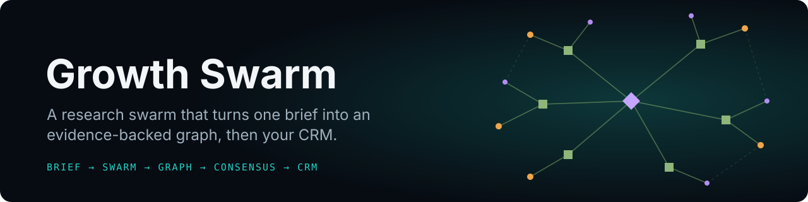
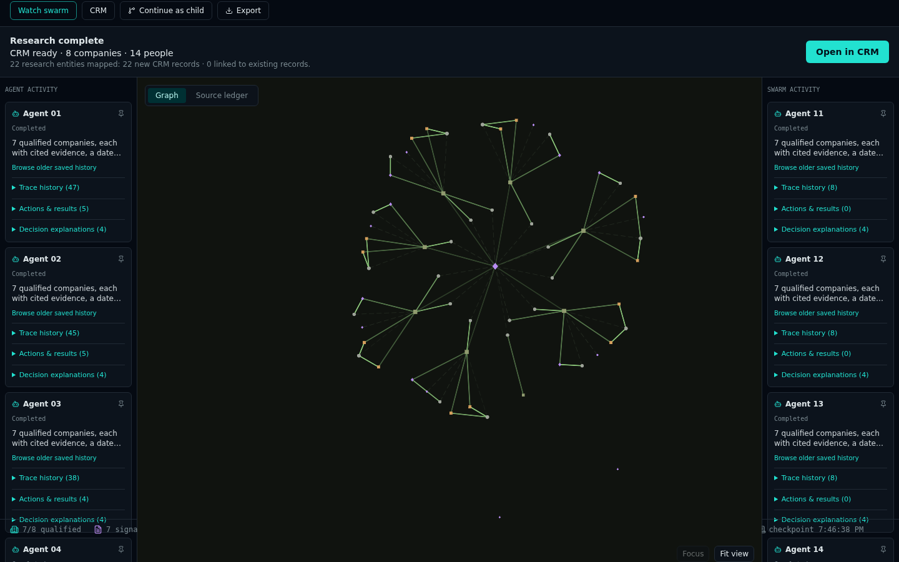
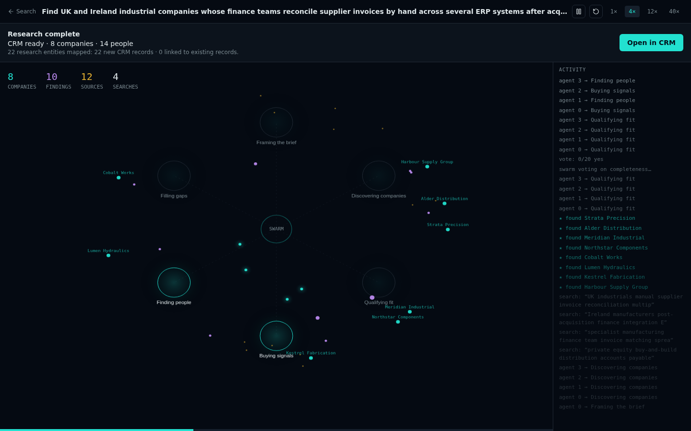
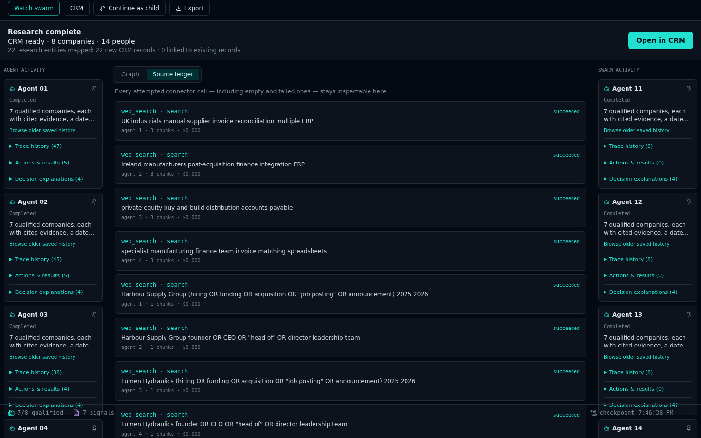
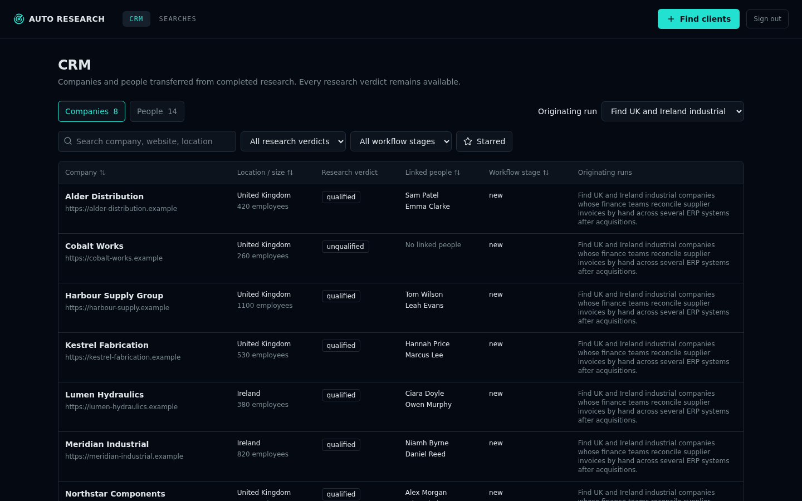
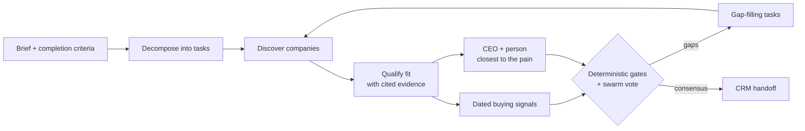

<div align="center">



<br>

[](src/)
[](tsconfig.json)
[](supabase/migrations/)
[](src/lib/connectors.server.ts)
[](src/components/GraphCanvas.tsx)
[](#evidence-first-by-design) 

**Give it a brief. A swarm of agents researches it, builds one shared, cited graph, votes on whether the job is done, and hands the result to your CRM.**

[**▶ Watch the demo**](#-see-it-run) · [**Run the demo locally**](#run-the-demo-in-30-seconds) · [**How it works**](#how-it-works) · [**Product spec**](PRD.md)

</div>

---

Most "AI research" tools return a confident paragraph. Growth Swarm returns a graph you can check.
You describe what you want found and what a finished answer looks like. Between 5 and 100 agents
split the brief into tasks, search the web, qualify what they find against your criteria, record
dated buying signals, and identify the people who own the problem. Every claim links to the exact
passage it rests on. The run ends only when your completion criteria pass and enough agents agree
on the same graph revision. A budget or time limit can also end it early.

It ships with a **go-to-market profile**: describe a pain and a market, and you get qualified
companies, demand signals, and named contacts, transferred straight into a built-in CRM. A **blank
brief** profile handles any other research question.

> The interface is currently branded **Auto Research**; Growth Swarm is the repository and project name.

## ▶ See it run

<div align="center">

<a href="docs/media/demo.mp4"></a>

<sub><b><a href="docs/media/demo.mp4">Full-quality MP4</a></b> · brief → live swarm → source ledger → swarm replay → CRM, recorded with <code>npm run demo</code>. Every company, person and source in this recording is <b>fictional</b>; the corpus lives in <a href="tests/lovable/gtm-demo.ts"><code>tests/lovable/gtm-demo.ts</code></a>.</sub>

</div>

<table>
<tr>
<td width="50%"><br><sub><b>One shared graph.</b> Companies, research notes and source passages, joined by typed evidence edges. Agent activity on both sides.</sub></td>
<td width="50%"><br><sub><b>Swarm replay.</b> Watch agents move between framing, discovery, qualification, signals, people and gap-filling, at 1× to 40×.</sub></td>
</tr>
<tr>
<td width="50%"><br><sub><b>Source ledger.</b> Every search, including empty and failed calls, with captured chunks and cost.</sub></td>
<td width="50%"><br><sub><b>Straight into the CRM.</b> Qualified and unqualified companies, linked people, and the run that found them.</sub></td>
</tr>
</table>

## Run the demo in 30 seconds

The demo runs the real setup screen, run engine, graph, swarm view and CRM in your browser. The
model, web search, auth and database are replaced with a deterministic in-memory fixture, so it
needs no accounts or keys and makes no paid calls.

```sh
npm ci
npm run demo
```

Open **http://127.0.0.1:4186/setup?fixture=gtm-demo**, choose **Advanced settings → Go-to-market
profile**, and start a run. You can type any brief; the fixture always researches its eight
fictional UK and Irish industrial companies, seven of which match the pain. In about 25 seconds
the swarm reaches consensus and the result lands in the CRM. Everything lives in memory and
disappears on reload.

## How it works



1. **Define the brief.** A task description and, optionally, completion criteria. Leave the
   criteria blank and they are generated from the task before the run starts.
2. **Pick a profile and sources.** Go-to-market (pain statement, universe, exclusions) or a blank
   brief. Sources are read-only; web search via Tavily is the first connector.
3. **Set the guardrails.** Swarm size (5–100), consensus threshold, time limit and cost cap.
   Guardrails are enforced by the engine, not suggested to the model.
4. **Watch it work.** The graph grows live while agent panels stream traces, actions and decision
   explanations. Stop at any time; partial results stay inspectable.
5. **Completion is earned.** Deterministic checks (company counts, dated signals, contacts,
   evidence integrity) must pass *and* enough of the configured roster must vote yes on the same
   graph revision. Agents that vote no are assigned the open gaps.
6. **Use the result.** Explore the graph and source ledger, export it, continue as a child run
   with a new brief (the parent is never modified), or open the transferred records in the CRM.

### Evidence first, by design

| Graph layer | What it holds |
|---|---|
| **Primary entities** | Companies and people, with typed fields such as website, location, size, role |
| **Research notes** | Qualification verdicts, demand signals, claims and open questions, each with a confidence |
| **Source chunks** | The exact passages returned by a connector, stored before any model sees them |

Edges are typed: *supports*, *contradicts* or *qualifies* for evidence, and separate relationships
for retrieved context, employment and semantic links. A model can propose findings, but it cannot
create source chunks or raise run limits. Unknowns stay unknown instead of being filled in.

## Two ways to run it

| | **Platform app** (`src/`) | **Standalone local app** (`server/`, `web/`) |
|---|---|---|
| Stack | TanStack Start + React, Supabase (auth, Postgres, RLS) | Node + React, embedded SQLite (`node:sqlite`) |
| Model | Lovable AI Gateway (`LOVABLE_API_KEY`) | OpenAI structured output (`OPENAI_API_KEY`) |
| Search | Tavily (`TAVILY_API_KEY`) | Tavily (`TAVILY_API_KEY`) |
| Extras | Swarm replay, CRM with workflow stages, notes and edit history | Cosmos live graph + Sigma explorer, Markdown vault / HTML report export, checkpoint recovery |
| Fictional mode | `npm run demo` (in-browser fixture, shown above) | Built-in *Demonstration* mode |

### Platform app

```sh
npm ci
npm run dev
```

It expects a Supabase project with the migrations in [`supabase/migrations`](supabase/migrations)
applied, plus `LOVABLE_API_KEY` and `TAVILY_API_KEY` set server-side. Without a Tavily key, web
search reports itself unavailable instead of failing silently.

### Standalone local app

Requires Node.js 24 or newer.

```sh
npm ci
npm run dev:legacy          # web on http://127.0.0.1:5173, API on 127.0.0.1:3001
```

With no keys it runs in **Demonstration** mode: a labelled fictional corpus that goes through the
same scheduler, capture, gates, checkpoints and exports. For live research, copy `.env.example` to
`.env` and set:

```dotenv
TAVILY_API_KEY=...
OPENAI_API_KEY=...
OPENAI_MODEL=gpt-4.1-mini      # checked against the models endpoint; never silently substituted
TAVILY_MAX_CALL_USD=0.01       # conservative per-call ceilings used for budget accounting
OPENAI_MAX_CALL_USD=0.05
```

Restart the API and choose **Research mode → Live research** under Advanced settings. Spend is
accounted at your configured per-call ceilings, not taken from provider invoices, and unsettled
calls stay reserved. Start with a small swarm and a low cost cap. Only one live run executes at a
time. State is stored in `.data/` (or `DATA_DIR`) and is git-ignored. This is a single-user
development server bound to loopback, so don't expose it publicly.

```sh
npm run build:legacy && npm run start:legacy   # built app on http://127.0.0.1:3001
```

## Project layout

```
src/routes/_authenticated/   setup, runs, live run, swarm replay, CRM (leads) screens
src/lib/swarm.server.ts      task decomposition, executors, gates and consensus evaluation
src/lib/crm-*.ts             CRM transfer, list, detail and workflow
src/components/              graph canvas, agent activity panels, CRM handoff and editor
supabase/migrations/         schema, RLS policies and CRM transfer functions
server/                      standalone engine, SQLite store, OpenAI + Tavily, exports
web/                         standalone React UI
shared/                      types and criteria shared by the standalone app
tests/lovable/               in-browser fixture harness, including the gtm-demo scenario
```

## Verification

```sh
npm run lint && npm run typecheck && npm run test          # platform app
npx tsx --test tests/lovable/fixture-db.test.ts             # fixture contract
npx playwright test --config playwright.lovable.config.ts   # platform UI in Chromium
npm run test:legacy && npm run typecheck:legacy             # standalone engine
npm run test:e2e:legacy                                     # standalone UI in Chromium
```

Browser suites need Chromium (`npx playwright install chromium`). No test makes live model or
search calls.

## Scope and limits

- Fixture and demonstration output is synthetic. It shows the workflow and is never real market
  research.
- Search uses Tavily snippets. Full pages are not fetched.
- The standalone app is a local, single-user implementation. Cloud release certification,
  multi-tenant connectors and large paid runs (20–100 agents) still need dedicated benchmarks.
  See [IMPLEMENTATION.md](IMPLEMENTATION.md).
- Growth Swarm only researches. It sends no outreach and publishes nothing.

<sub>Product requirements: [PRD.md](PRD.md) · Implementation status: [IMPLEMENTATION.md](IMPLEMENTATION.md) · Agent notes: [AGENTS.md](AGENTS.md)</sub>
